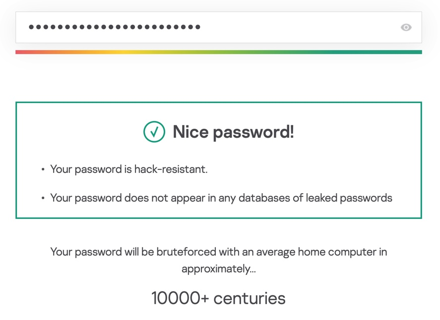

# randstr - a random string generator 

A super simple random string generator suitable for passwords **(cryptographic strength entropy)** and the creation of all sorts of random jibberish. 

A quick look on [Kasperski Password Check](https://password.kaspersky.com/) _**using a default generated string**_ gives the following



## Source (this stuff) 

This is a very basic Go module with all logic comtained within `main.go`. _Comments omitted since it should be pretty much self explanatory._ 

## Installation

**Go** 

```shell 
go install github.com/stuartinnes/randstr
```

**Homebrew**

```shell 
brew install stuartinnes/tap/randstr
```

## Arguments

```shell 
--chars value, -c value    (default: 8)
--digits value, -d value   (default: 8)
--symbols value, -s value  (default: 8)
--help, -h                 show help
```

## Example 

```shell 
#generate astring with 12 characters, 12 digits and no symbols
randstr -c 12 -d 12 -s 0
```
